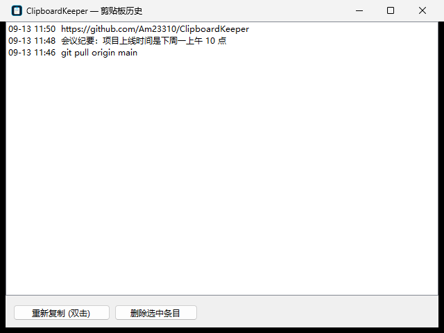

# ClipboardKeeper — Windows 剪贴板历史记录工具



## 1. 项目解决什么问题

Windows 自带的剪贴板一次只能保留"最近一条"内容：你复制了新东西，上一条就没了；电脑重启后剪贴板直接清空。 ClipboardKeeper 解决这两个痛点：

- **复制过的文字不再丢失**——每一段复制的内容都被自动记录成可查、可找回的历史；
- **历史跨重启保留**——记录落在磁盘文件里，开机自启后自动加载上一次的全部记录。

定位是"轻量后台工具"：单文件 exe、零外部依赖、不联网、消息驱动监听（不轮询，基本不占 CPU）。

## 2. 主要功能

| 功能 | 说明 |
|---|---|
| 自动记录 | 复制任何**文字**（含中文）自动入库，无需任何操作 |
| 去重置顶 | 重复复制同一段内容，不产生重复条目，而是把已有条目移到最前 |
| 跨重启保留 | 历史存于磁盘，程序重启/电脑重启后原样恢复 |
| 开机自启 | 首次运行自动注册自启（写 `HKCU\Software\Microsoft\Windows\CurrentVersion\Run`），托盘菜单可一键开关 |
| 查看与回用 | 历史窗口列出所有记录，双击任意条目即可重新复制到剪贴板 |
| 管理 | 支持单条删除、一键清空（带确认框）、暂停记录 |
| 容错 | 历史文件损坏时按空历史处理不崩溃；意外异常只记日志（`error.log`），不弹崩溃框 |

限制：**只记录文字**，图片、文件、富文本不会记录；历史上限 1000 条，超出后最旧的自动淘汰。

## 3. 安装方法

方式一（推荐）：直接用成品

1. 把 `ClipboardKeeper.exe` 复制到 `%LOCALAPPDATA%\ClipboardKeeper\`（固定安装位置，避免之后移动导致自启路径失效）；
2. 双击运行一次。首次运行会自动注册开机自启，托盘区（右下角，可能折叠在 `^` 箭头里）出现图标即安装成功。

方式二：自己构建（只依赖 Windows 自带的 .NET Framework 4 编译器，无需装任何东西）

```bat
build.bat
```

脚本会先运行 6 个核心逻辑单元测试，全绿后生成 `app.ico` 并编译出 `ClipboardKeeper.exe`（图标已内嵌）。

卸载：托盘右键 → 先取消"开机自启" → 退出；然后删除 exe 和数据目录 `%APPDATA%\ClipboardKeeper\`。

## 4. 使用方法

安装后**无需日常操作**，正常复制即可被记录。需要管理时用托盘图标：

| 操作 | 方式 |
|---|---|
| 查看历史 | 左键**双击**托盘图标，或右键菜单"查看历史"；启动时加 `--show` 参数可直接打开历史窗口 |
| 找回某条内容 | 历史窗口中**双击**该条目（或选中后点"重新复制"），内容回到剪贴板，并弹出气泡提示 |
| 删除单条 | 历史窗口选中条目 → 点"删除选中条目" |
| 清空全部 | 右键菜单"清空所有记录" → 确认 |
| 暂停/恢复记录 | 右键菜单"暂停记录"，暂停期间复制的内容不记录 |
| 开关开机自启 | 右键菜单"开机自启"（勾选状态即当前状态） |
| 关闭历史窗口 | 直接点 X——只是隐藏，不会丢数据、不会崩溃 |
| 退出程序 | 右键菜单"退出"（退出后不再记录，已有历史保留在文件里） |

## 5. 输入输出示例

**输入**：你在任何地方按 Ctrl+C 复制的文字。例如依次复制：

```text
第1次：项目上线时间是下周一上午10点
第2次：git pull origin main
第3次：项目上线时间是下周一上午10点   ← 与第1次相同，触发去重置顶
```

**输出 1 — 屏幕上**：打开历史窗口看到（最新在最上，只有两次去重后的条目）：

```text
09-13 20:10  项目上线时间是下周一上午10点
09-13 20:08  git pull origin main
```

**输出 2 — 磁盘文件** `%APPDATA%\ClipboardKeeper\history.json`（程序每次记录后自动写入）：

```json
[{"Text":"项目上线时间是下周一上午10点","At":"\/Date(1789300200000)\/"},
 {"Text":"git pull origin main","At":"\/Date(1789300080000)\/"}]
```

`At` 是 .NET JavaScriptSerializer 的时间戳格式（UTC 毫秒数），窗口里显示的是本地时间。

**输出 3 — 单元测试**（`build.bat` 第一步，或手动运行 `selftest.exe --selftest`）：

```text
PASS  add puts new item first with timestamp
PASS  duplicate copy moves item to top instead of duplicating
PASS  items beyond the cap are dropped oldest first
PASS  save then load on a fresh store keeps all records (reboot survives)
PASS  load with no file yet yields empty history, not a crash
PASS  clear empties history and persists

ALL TESTS PASSED
```

任一测试失败时退出码非 0，构建随即中止——保证"测试不过不出包"。

## 项目结构

| 文件 | 说明 |
|---|---|
| `HistoryStore.cs` | 核心逻辑：记录、去重、上限截断、JSON 持久化（纯逻辑，可单测） |
| `Program.cs` | 程序入口 + `--selftest` 单元测试（TDD 约定：改行为前先加失败测试） |
| `TrayContext.cs` | 托盘常驻、剪贴板监听（WM_CLIPBOARDUPDATE）、历史窗口 |
| `icon-gen.cs` | 图标生成器：GDI+ 绘制 → 7 个尺寸打包成 `app.ico` |
| `app.ico` / `icon-preview.png` | 图标成品与预览 |
| `build.bat` | 一键构建：测试 → 图标 → exe（保持 ASCII，cmd 按 GBK 解析批处理） |

## 技术要点

- .NET Framework 4 / C# 5，系统自带 `csc.exe` 直接编译
- `AddClipboardFormatListener` + `WM_CLIPBOARDUPDATE` 消息监听，事件驱动，不轮询
- JSON 序列化用 `JavaScriptSerializer`；历史文件损坏时按空历史处理
- 历史窗口关闭 = 隐藏而非销毁（避免"无法访问已释放的对象"崩溃）
- 未处理异常统一兜底写入 `%APPDATA%\ClipboardKeeper\error.log`
